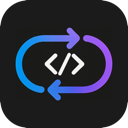

# DevCapsule

개발자들을 위한 데스크탑 도구 – `.env` 백업 및 프로젝트 복구



---

## 💡 제작 배경

SI 프로젝트를 하다 보면 항상 골칫거리가 되는 게 `.env` 파일이다.  
백업해뒀다고 생각했는데 막상 필요할 땐 없고, 이게 누구 프로젝트였는지도 헷갈리고...  
지금 내 노트북엔 프로젝트가 무려 65개나 되는데,  
안 쓸 것 같아 지웠다가 나중에 다시 실행하려면 GitHub, 회사 GitLab, 개인 GitLab 왔다 갔다 하며 다시 클론하고 설정하는 데 시간만 줄줄 새고...

처음엔 터미널에서 쓰는 CLI 툴로 만들 생각이었지만,  
ChatGPT가 "이거 오픈소스로 하면 괜찮겠다~!" 하는 말에 혹해서 Electron으로 GUI 버전까지 만들게 된 사연 깊은 프로그램이다.

Electron은 처음이라 ChatGPT가 많은 도움을 줬다. 1번째 기여자이다.

---

## 🧩 개요

**DevCapsule**은 여러 프로젝트를 동시에 관리해야 하는 개발자들을 위한 데스크탑 애플리케이션이다.  
`.env` 파일의 백업과 복구를 중심으로, 프로젝트 상태를 한눈에 확인하고 손쉽게 복원할 수 있도록 도와준다.

- **프레임워크:** Quasar (Vue 3 Options API 기반)
- **템플릿 엔진:** Pug
- **배포 형태:** Electron 앱

---

## 🔧 주요 기능

### 📁 프로젝트 등록 및 분석

- Git 정보 (원격 저장소, 브랜치, 커밋 로그 등) 분석

### 🧠 변경 감지 및 백업

- `.env` 파일의 생성, 수정, 삭제를 실시간 감지
- 변경된 파일만 자동 백업
- 폴더 이동 및 경로 수정 시 기존 프로젝트와 유사도 비교 후 재 연결

### ♻️ 삭제 및 복원

- 프로젝트가 삭제되어도 `.env` 백업과 Git 정보 기반으로 클릭 한 번에 복구
- 복원 시: `git clone` → `.env` 복원까지 자동 수행

### 🔄 멀티 디바이스 동기화

여러 대의 PC에서 동일한 DevCapsule 데이터(프로젝트 목록과 `.env` 백업)를 안전하게 공유합니다. Git 원격 저장소의 `devcapsule` 브랜치를 사용해 자동으로 동기화합니다.

#### 동작 개요

- **백업 대상:** `envs/db/projects.json`, `envs/files/**`, `envs/README.md` 등 DevCapsule 전용 데이터만 관리합니다.
- **브랜치:** 전용 브랜치 `devcapsule`에서만 동작합니다.
- **충돌 처리:** 파일별 전략으로 안전하게 병합합니다.
  - `db/projects.json`: 타임스탬프 기반 병합으로 최신 항목 우선
  - `files/**`(.env): 원격(다른 PC) 버전 우선 선택
  - `README.md`: 로컬 유지 후 DB 기준으로 재생성
- **자동 동기화:** 5분마다 원격 변경을 체크하고, 필요 시 자동 `pull` 및 정리 후 `push`합니다.

#### 준비 사항

- 개인 GitHub/GitLab 등 원격 저장소 주소 1개
- 저장소에 접근 가능한 인증(SSH 또는 HTTPS 토큰)

#### 설정 방법

1. 설정 화면에서 원격 저장소 URL을 입력해 연결합니다.
   - 최초 연결 시:
     - 원격에 `devcapsule` 브랜치가 없으면 로컬 데이터를 생성 후 `push`합니다.
     - 이미 브랜치가 있으면 우선 `pull`로 원격 데이터를 내려받고 병합합니다.
2. 이후부터는 변경 감지 시 자동 커밋/푸시, 주기적 원격 체크로 동기화됩니다.

#### 동기화가 수행하는 일

- 원격과 비교해 변경이 있으면 `pull` → 보안 정리(허용되지 않은 파일 제거) → 로컬 DB/README 재생성 → 필요 시 `push`까지 처리합니다.
- 수동 동기화가 필요할 때는 설정 화면의 동기화 버튼으로 즉시 실행할 수 있습니다.

#### 제한 및 주의사항

- DevCapsule는 전용 데이터만 관리합니다. 원치 않는 파일 업로드를 막기 위해 `envs` 폴더 내에서 허용된 항목 외(`.git`, `db`, `README.md`, `files`)는 자동으로 삭제합니다.
- 오프라인 상태에서는 Git 작업을 건너뛰고, 온라인이 되면 자동으로 재시도합니다.
- 동일 프로젝트를 여러 PC에서 동시에 수정하는 경우, `.env`는 원격 우선 규칙으로 덮어써질 수 있습니다.

#### 트러블슈팅

- 인증 실패나 네트워크 오류가 발생하면 설정 화면에서 저장소 URL과 인증 방법을 확인하세요.
- 충돌 메시지가 보이면 자동 병합이 진행되며, 완료 후 DB 기준으로 README가 다시 생성됩니다.

---

## 🚀 설치 및 실행

### 개발 모드

```bash
git clone https://github.com/eyesofsiche/devcapsule.git
cd devcapsule
npm install
npm run dev
```
